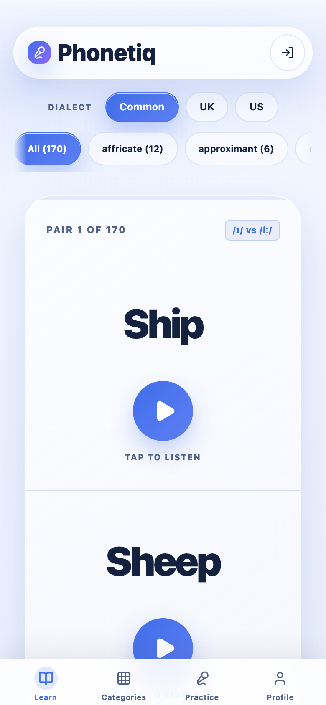
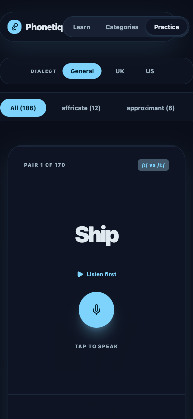
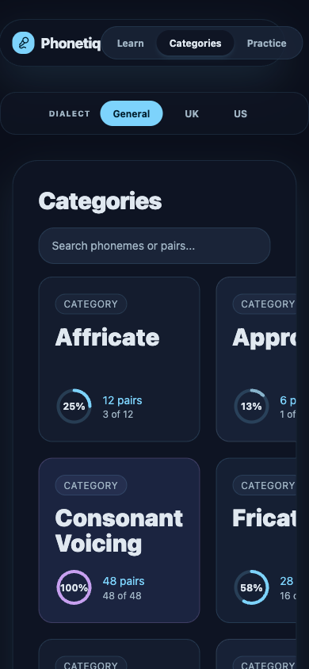

# Phonetiq

[](LICENSE)
[](https://workers.cloudflare.com/)
[](https://react.dev/)
[](https://www.typescriptlang.org/)

**Live:** [phonetiq.mihassan.com](https://phonetiq.mihassan.com) | **API:** [api.phonetiq.mihassan.com](https://api.phonetiq.mihassan.com)

A web app for practicing English **minimal pair pronunciation** — words that differ by only one sound, like *ship* vs *sheep*. Built entirely on the Cloudflare stack.

**Learn Mode** — hear the correct pronunciation of each word via pre-generated TTS audio.
**Practice Mode** — complete refreshable adaptive sessions (15 pairs) and get instant AI feedback from candidate-constrained speech recognition.
**Profile Mode** — review key stats, weak pairs/categories, and launch weak-pair practice.

## Screenshots

### Mobile

| Learn | Practice | Categories |
| --- | --- | --- |
|  |  |  |

## Features

- 186 curated word pairs across 9 phoneme categories (vowels, consonants, fricatives, affricates, liquids, nasals, sibilants, approximants)
- Dialect-aware pair filtering (`Common`=`all`, `UK`=`uk_only`, `US`=`us_only` support in schema)
- Adaptive Practice sessions: 15-pair batches with 5 weak-pair quota + unseen/medium-weak filler
- Local progress tracking (attempts, accuracy, completions, streaks, weak-pair signals)
- Profile stage with key stats + weak-pair practice action
- Cross-platform speech recognition using `MediaRecorder` + Workers AI (`@cf/openai/whisper-large-v3-turbo`)
- Candidate-constrained recognition (2 target words) with explicit `no_match` fallback
- Category filtering, progress ring countdown, and responsive mobile-friendly UI
- Two-tier rate limiting to protect the AI endpoint from abuse

## Tech Stack

| Layer | Technology |
| --- | --- |
| Frontend | React 19, Vite, Tailwind CSS v4, Lucide React |
| Backend API | Cloudflare Workers + Hono |
| Database | Cloudflare D1 (SQLite) + Drizzle ORM |
| Audio Storage | Cloudflare R2 (pre-generated `.m4a` files) |
| Speech Recognition | Cloudflare Workers AI (`@cf/openai/whisper-large-v3-turbo`) |
| Hosting | Cloudflare Pages (frontend) + Cloudflare Workers (API) |
| Custom Domains | `phonetiq.mihassan.com` (frontend), `api.phonetiq.mihassan.com` (API) |
| CI/CD | GitHub Actions (`cloudflare/wrangler-action`) for both frontend and API |

## Project Structure

```
Phonetiq/
  api/                        # Cloudflare Worker (Hono)
    src/
      index.ts                # Worker entrypoint + rate limiting middleware
      routes/
        pairs.ts              # GET /api/pairs, GET /api/pairs/categories
        audio.ts              # GET /api/audio/:word (serves from R2)
        recognize.ts          # POST /api/recognize (dialect-aware Whisper STT)
      db/
        schema.ts             # Drizzle ORM schema
        seed.sql              # 186 word pairs seed data
    drizzle/                  # Generated SQL migrations
    wrangler.toml             # Bindings: D1, R2, AI, Rate Limiters
  web/                        # React SPA (Vite)
    src/
      App.tsx                 # Main app with Learn/Categories/Practice/Profile modes
      components/
        PairCard.tsx          # Learn mode: word display + audio playback
        PracticeCard.tsx      # Practice mode: record + STT + feedback
        ProfileStage.tsx      # Profile mode: key stats + weak areas/actions
        Navigation.tsx        # Prev/Next navigation
        CategoryFilter.tsx    # Category filter pills
        DialectFilter.tsx     # Dialect selector pills
      hooks/
        useAudioRecorder.ts   # MediaRecorder wrapper
        usePracticeSession.ts # Session state (batch practice + progress)
      lib/
        api.ts                # API client functions
        pairSelection.ts      # Adaptive batch selection helpers
        progressStorage.ts    # Local progress persistence
        progressMetrics.ts    # Derived stats (profile/categories)
        types.ts              # Shared TypeScript types
  scripts/
    generate-audio.sh         # TTS audio generation + R2 upload
  docs/
    PRD.md                    # Product requirements
    DESIGN.md                 # Architecture & design decisions
  .github/workflows/
    deploy-api.yml            # CI/CD for Worker deployment
    deploy-web.yml            # CI/CD for Pages deployment
```

## Local Development

### Prerequisites

- Node.js >= 20
- macOS (for audio generation via `say` command)
- Cloudflare account (for Workers AI; D1 and R2 work locally without auth)

### 1. Install dependencies

```bash
cd api && npm install
cd ../web && npm install
```

### 2. Set up the database

```bash
cd api

# Apply migration to local D1
npm run db:migrate:local

# Seed word pairs
npm run db:seed:local
```

### 3. Generate and upload audio files

```bash
# From project root — generates 338 .m4a files and uploads to local R2
./scripts/generate-audio.sh

# To regenerate all (overwrite existing):
./scripts/generate-audio.sh --force
```

### 4. Run the app

Start both the API worker and the frontend dev server:

```bash
# Terminal 1: API (port 8787)
cd api && npx wrangler dev

# Terminal 2: Frontend (port 5173, proxies /api to 8787)
cd web && npm run dev
```

Open http://localhost:5173 in your browser.

### Running tests

```bash
cd web && npm test
```

## Deployment

### 1. Provision Cloudflare infrastructure

```bash
cd api

# Create production D1 database (copy the database_id into wrangler.toml)
npx wrangler d1 create phonetiq-db

# Apply migrations and seed data
npx wrangler d1 migrations apply phonetiq-db --remote
npx wrangler d1 execute phonetiq-db --file=src/db/seed.sql --remote

# Create production R2 bucket
npx wrangler r2 bucket create phonetiq-audio

# Create Pages project
npx wrangler pages project create phonetiq --production-branch main
```

### 2. Upload audio files to R2

Upload the 338 `.m4a` files from `.audio-cache/` to the `phonetiq-audio` R2 bucket via the Cloudflare Dashboard (R2 > phonetiq-audio > Upload Files).

### 3. Deploy manually (first time)

```bash
# Deploy API Worker
cd api && npx wrangler deploy

# Build and deploy frontend
cd web && VITE_API_URL=https://api.phonetiq.mihassan.com npm run build
npx wrangler pages deploy dist --project-name phonetiq
```

### 4. CI/CD (automatic on push)

Both the API Worker and frontend are auto-deployed via GitHub Actions on push to `main`:

- `.github/workflows/deploy-api.yml` — triggers on changes to `api/`
- `.github/workflows/deploy-web.yml` — triggers on changes to `web/`

**Required GitHub secrets:**

| Secret | Value |
| --- | --- |
| `CLOUDFLARE_API_TOKEN` | API token with Workers Scripts Edit + Cloudflare Pages Edit permissions |
| `CLOUDFLARE_ACCOUNT_ID` | Your Cloudflare account ID |

### 5. Custom domains

- **Frontend:** Add `phonetiq.mihassan.com` via Pages > Custom domains (requires a CNAME record pointing to `phonetiq.pages.dev`)
- **API:** Configured in `api/wrangler.toml` via `routes` with `custom_domain = true` (auto-creates DNS record)

## Documentation

- [Product Requirements (PRD)](docs/PRD.md)
- [Design Document](docs/DESIGN.md)
- [Project Memory](PROJECT.md)

## License

This project is licensed under the [MIT License](LICENSE).
